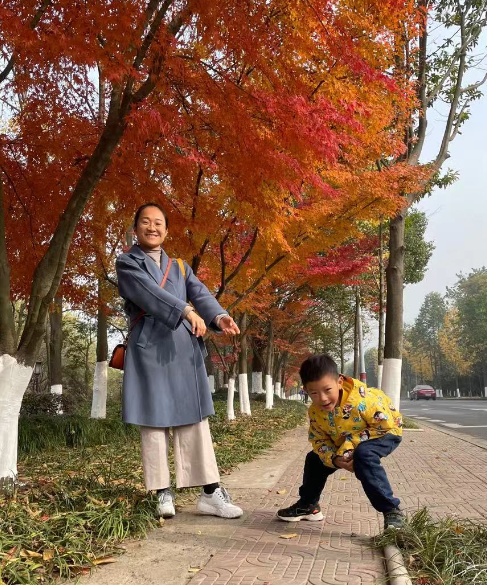

这次湘湖探索主要集中在湘湖一期的东南面，从望湖楼停车场开始，一路向西走，然后沿着一条湖中小径穿越，然后走到城山广场爬山到达越王祠，望湖亭，然后沿着山间小路，一步步走到城山停车场。

到达地面后，继续向东以环形方式走回起点。途中有一个天猫小店，边上就有湘湖观鱼，还有小涌泉，小桥，芦苇，长廊。整个环境静谧，悠闲，再加上温暖的阳光，一路探索回到停车场，整个历时3小时15分钟。

然后买了麦当劳打包回家吃，睡觉。

睡醒4点开始准备晚上火锅的食材。有油面筋，油豆腐，香肠，茼菜，生菜，丸子，虾滑，鸭血，羊肉卷。食材准备还是有点多，下次需要考虑减少每样总量，控制摄入。不然每次都容易吃太多，可能导致不消化。

这里有一个特别需要注意的点是：未来出行需要进一步控制时间节点，特别是午餐时间点。避免太晚吃导致的饮食不规律，造成身体的不舒适。