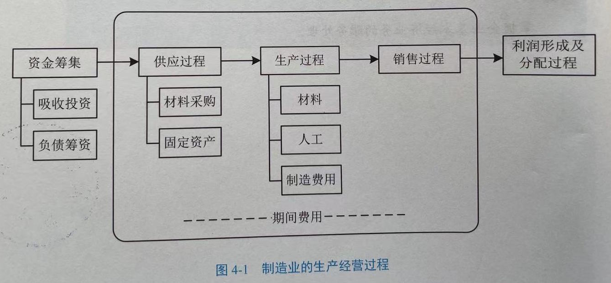

# 前言


对于工作，我们需要锻炼不一样的能力，这种能力既包含专业能力，也包含业务能力。当工作到达一定年限后，我们往往已经在专业能力上有了一定的积累，这个时候业务能力的学习与积累就会显得越来越重要。而对于不同的业务形态，业务流程，我们要学习的还有很多。

```
积跬步以致千里
```

学习业务，掌握业务，利用专业能力来提升业务水平这是一条光明大道。

基于此，我就总结一下我在今年国庆期间学习的《基础会计实务》这本书的主要内容，特此摘录如下，供自己复习之用，希望也能帮助到你。

# 会计的概念

会计以货币为主要计量单位，运用专门的方法和程序，对一定的经济单位的经济活动进行核算和监督，并向有关经济信息使用者提供财产信息的一种管理活动。

# 会计的特征

- 会计以货币作为主要计量单位
- 会计采用一系列专门的方法
- 会计具有核算和监督的基本职能
- 会计的对象是一个单位的经济活动
- 会计的本质是一种经济管理活动

# 会计的对象和目标

会计的对象：特定主体能够以货币表现的经济活动。以货币表现的经济活动通常又称作价值运动或资金运动。

```
资金运动包括：特定主体的资金投入，资金运用和资金退出。
```

# 会计按其使用单位分类 

主要包括以下几种：

- 行政单位会计
- 事业单位会计
- 企业会计

# 资金运动的过程

内容如下：


# 企业资金来源

内容如下：


# 企业资金占用

内容如下：


这些资金的**占用实质**是指企业拥有了经营所必需的经济资源，会计上称之为资产。

# 会计的目标

向财务会计报告的使用者提供企业的财务状况，经营成果和现金流量等有关的会计信息，反映企业管理层受托责任履行情况，有助于财务会计报告使用者做出经济决策。

会计的目标主要包括两个方面：

- 向会计信息使用者提供对决策者有用的会计信息
- 反映企业管理层受托责任的履行情况

# 会计的职能

- 会计核算
- 会计监督

# 会计核算

会计核算是一个连续、系统和完整的过程，包括4个环节：

- 确认（经济业务）
- 计量（经济业务）
- 记录（会计凭证，会计账薄）
- 报告（账薄）

# 计量属性

- 历史成本
- 公允价值
- 重置价值
- 可变现净值
- 现值

**历史成本**：为取得或制造某项财产物资实际支付的现金或其他等价物（实际成本）。

**重置成本**：按照当前市场条件，重新取得同样一项资产所需要支付的现金或现金等价物金额（现行成本）。

**可变现净值**：在正常的生产经营过程中，以预计售价减去进一步加工成本和预计销售费用，以及相关税费后的净值。

**现值**：对未来现金流以恰当的折现率进行折现后的价值，是考虑资金时间价值的一种计量属性。

**公允价值**：资产和负债按照市场参与者在计量日发生的有序交易，出售资产所能收到或转移负债所需支付的价格。

# 会计核算的内容

- 款项和有价证券的收付
- 财物的收发，增减和使用
- 债权、债务的发生和结算
- 资本、基金的增减，收入，支出，费用，成本的计算
- 财务成果的计算和处理
- 需要办理会计手续、进行会计核算的其他事项

# 会计对资金运动的监督

主要表现在：

- 监督经济业务的真实性
- 监督财务收支的合法性
- 监督公共财产的完整

# 会计监督的特点

- 主要通过货币计量
- 按其经济活动过程的关系，可分为：事前监督、事中监督、事后监督

# 会计核算的方法

主要包括有：

- 设置会计科目与账户
- 复式记账
- 填制和审核记账凭证
- 登记账薄
- 成本计算
- 财产清查
- 编制财务会计报告 

# 复式记账

对于每一笔经济业务，都必须用相等的金额在**两个或两个以上相互联系的账户中进行登记**，系统地反映会计要素增减变化及其结果的一种记账方法。

# 会计信息质量要求

- 客观性原则 
- 相关性原则
- 可理解性原则
- 可比性原则
- 实质重于形式原则
- 重要性原则 
- 谨慎性原则
- 及时性原则

# 会计法规体系

我国会计法规体系的三个层次：

- 基本法：《中华人民共和国会计法》
- 会计准则
- 国家制定的企业会计制度和行政，事业单位会计制度

# 会计准则

- 基本准则
- 具体准则

**具体准则**主要内容包括：

- 一般业务准则
- 特殊行业和特殊业务准则
- 财务报告准则

# 会计要素

我国《企业会计准则——基本准则》将会计要素划分为：

- 资产（资产负债表）
- 负债（资产负债表）
- 所有者权益（资产负债表）
- 收入（利润表）
- 费用（利润表）
- 利润（利润表）

# 资产

**含义**：资产是指企业**过去**的交易或者事项形成的，由**企业拥有或者控制的**，预期会给企业**带来经济利益**的资源。资产必须是**现实**的资产。

**特征**：

- 由企业过去的交易或者事项形成的
- 必须为企业拥有或者控制
- 能够给企业带来预期的经济利益

```
经济利益：直接或间接流入企业的现金或现金等价物。
```

**确认条件**：

- 与该资源有关的经济利益很可能流入企业
- 该资源的成本或价值能够可靠地计量

**分类**：

按流动性划分：

- 流动资产
- 非流动资产

```
一个正常营业周期：
企业从购买生产资料起至加工生产的产品实现销售，并转化为现金或现金等价物的期间。
```

流动资产有：

- 库存现金
- 银行存款
- 交易性金融资产
- 应收及预付款项
- 存货

非流动资产有：

- 长期股权投资
- 固定资产
- 无形资产
- 其他长期资产

**资产的分类如下图所示**：


# 负债

**含义**: 负债是企业**过去**的交易或事项形成的，预期会导致**经济利益流出企业**的**现时义务**。

**特征**:

- 由过去的交易或事项形成的
- 负债的清偿预期会导致经济利益流出企业
- 负债是企业承担的现时义务 

**确认条件**:

- 与该义务有关的经济利益很可能流出企业
- 未来流出的经济利益的金额能够可靠地计量

**负债的分类如下图所示**：


# 所有者权益

**含义**：企业**资产扣除负债后**，由所有者享有的**剩余权益**。

**特征**：

- 除非发生减资、清算或分派现金股利，否则企业不需要偿还所有者权益
- 企业清算时，只有在清偿所有的负债后，所有者权益才返还给所有者
- 所有者凭借所有者权益能够参与利润的分配

**确认条件**：

所有者权益在数量上等于企业资产总额扣除债权人权益后的净额，即为企业的净资产，它反映所有者（股东）在企业资产中享有的经济利益。

**来源**：

- 所有者投入的资本
- 直接计入所有者权益的利得和损失
- 留存收益

```
留存收益：盈余公积和未分配利润的统称，是企业在生产经营过程中所创造的，
但由于企业经营发展的需要或法定的原因，没有分配给所有者而留存在企业的盈利。
```

盈余公积：

- 法定盈余公积
- 任意盈余公积

**所有者权益的分类如下图所示**


# 收入

**含义**：企业在日常活动中形成的，会**导致所有者权益增加**的，**与所有者投入资本无关**的经济利益的**总流入**。

**特征**：

- 从企业的日常活动中产生的，而不是从偶发的交易或事项中产生的
- 收入能引起企业所有者权益的增加
- 收入是与所有者投入资本无关的经济利益的总流入
- 不包括企业代第三方收取的款项

**确认条件**：

- 与收入相关的经济利益应当很可能注入企业
- 经济利益流入企业的结果会导致资产的增加或负债的减少
- 经济利益与流入额能够可靠计量

**收入的分类**：


# 费用

**含义**：企业在日常活动中发生的，会**导致所有者权益减少**的**与向所有者分配利润无关**的经济利益的**总流出**。

**分类**：

- 生产费用
- 期间费用

**费用的分类**：


# 利润

**含义**：企业在一定会计期间的经营成果。

**特征**：

- 一定会计期间的经营成果
- 还包括了日常经营活动以外的事项 

**分类**：

- 营业利润
- 利润总额
- 净利润

**1. 营业利润**：

营业利润 = 营业收入 - 营业成本 - 税金及附加 - 管理费用 - 销售费用 - 财务费用 - 资产减值损失 + 公允价值变动收益 （- 公允价值变动损失） + 投资收益 （- 投资损失）

**2. 利润总额**：

利润总额 = 营业利润 + 营业外收入 - 营业外支出

**3. 净利润**:

净利润 = 利润总额 - 所得税费用

# 会计等式的表现形式

**1. 财务状况等式**：

资金占用 = 资金来源，即：资产 = 权益 （负债 + 所有者权益）

**2. 经营成果等式**：

收入 - 费用 = 利润

**3. 综合等式**：

资产 = 负债 + 所有者权益 + （收入 - 费用），即：资产 + 费用 = 负债 + 所有者权益 + 收入

# 会计科目

**含义**：对会计要素按照具体内容进行分类核算的项目或名称。

**分类**：

**1. 按反映的经济内容分类**：

- 资产类
- 负债类
- 共同类
- 所有者权益类
- 成本类
- 损益类

**2. 按提供信息的详细程度及其统驭关系分类**：

- 总分类科目
- 明细分类科目

**会计科目的设置，基本原则**：

- 合法性
- 相关性
- 实用性

# 账户四要素

- 期初余额
- 期末余额
- 本期增加发生额
- 本期减少发生额

对于同一个账户而言，基本关系为：

```
期末余额 = 期初余额 + 本期增加发生额 - 本期减少发生额
```

# 账户内容

- 账户名称，即会计科目
- 日期，即所依据记账凭证中注明的日期
- 凭证字号，即所依据记账凭证的编号
- 摘要，即经济业务的简要说明
- 金额，即增加额，减少额和余额

# 会计记账方法

- 单式记账法
- 复式记账法

# 复式记账法 

**优点**:

- 能全面反映资金运动的来龙去脉
- 便于试算平衡

**种类**:

- 收付记账法
- 增减记账法
- 借贷记账法

**借贷记账法的记账规则**:

- 有借必有贷
- 借贷必相等

**试算平衡的分类**:

- 发生额试算平衡：全部账户借方发生额合计 = 全部账户贷方发生额合计
- 余额试算平衡：全部账户借方余额合计 = 全部账户贷方余额合计


# 制造业企业示例

制造业企业的生产经营过程如下所示：



**企业筹资途径**:

- 接受投资者投入的资金，即企业的资本金
- 向债权人借入的资金，即企业的负债

**资金筹集业务内容如下所示**：


# 所有者投入资本的构成

**按投资人分**：

- 国家资本金
- 法人资本金
- 个人资本金
- 外商资本金

```
货币资金、实物资产、无形资产。
```

**实收资本（或股本）**： 企业的投资者按照企业章程，合同或协议的约定，实际投入企业的资本金以及按照有关规定由资本公积，盈余公积等转增资本的资金。

**资本公积**： 企业收到投资者投入的超出其在企业注册资本（或股本）中所占份额的投资，以及直接计入所有者权益的利得和损失。

**负债筹资**:

- 短期借款
- 长期借款
- 结算形成的负债

**短期借款的账务处理**:

- 借入短期借款
- 计提利息
- 偿还利息及本金的处理

**利润分配的顺序**:

- 弥补以前年度亏损
- 提取法定盈余公积
- 提取任意盈余公积
- 向投资者分配利润

# 会计凭证

**含义**：记录经济业务事项的发生或者完成情况，明确经济责任，并作为记账依据的书面证明。

**作用**：

- 记录经济业务，提供记账依据
- 明确经济责任，强化内部控制
- 监督经济活动，控制经济运行

**种类**：

- 原始凭证
- 记账凭证

**1. 按原始凭证（来源）**:

- 自制原始凭证
- 外来原始凭证

**2. 按格式**:

- 通用凭证
- 专用凭证

**3. 按填制的手续和内容分类**:

- 一次凭证
- 累计凭证
- 汇总凭证

**原始凭证的格式和内容（基本内容）**:

- 凭证的名称
- 填制凭证的日期
- 填制凭证单位名称或者填制人姓名
- 经办人员的签名或者盖章
- 接受凭证单位名称
- 经济业务内容
- 数量，单价和金额

**记账凭证的基本内容**:

- 填制凭证的日期
- 凭证编号
- 经济业务摘要
- 会计科目
- 金额
- 所附原始凭证张数
- 填制凭证人员，稽核人员，记账人员，会计机构负责人，会计主管人员等签名或盖章

# 会计账薄

**作用**:

- 记载和储存会计信息
- 分类和汇总会计信息
- 检查和校正会计信息
- 编报和输出会计信息

**分类**: 

**1. 按用途：**

- 序时账薄
- 分类账薄
- 备查账薄

**2. 按账页格式：**

- 三栏式账薄
- 多栏式账薄
- 数量金额式
- 横线登记式

**3. 外形特征：**

- 订本式
- 活页式
- 卡片式
- 磁盘式

# 账务处理程序

**分类**：

- 记账凭证账务处理程序
- 汇总记账凭证账务处理程序
- 科目汇总表账务处理程序

**记账凭证账务处理程序**:


**汇总记账凭证账务处理程序**:


**科目汇总表账务处理程序**:


# 财产清查种类

**1. 按清查范围：**

- 全面清查：对本企业的全部财产进行的盘点和核对
- 局部清查：只对部分财产进行盘点和核对

全面清查的情况：

- 年终决算前
- 单位撤消，合并或改变隶属关系时
- 中外合资，国内联营时
- 开展清查资产时
- 单位主要负责人调离工作时

局部清查的情况：

- 库存现金
- 银行存款和银行借款
- 材料，在产品和产成品
- 贵重的财产物资
- 债权债务

**2. 按清查时间：**

- 定期清查
- 不定期清查

**3. 按清查执行单位：**

- 内部清查
- 外部清查

# 财产清查一般程序

- 建立财产清查小组
- 组织清查人员学习有关政策规定，掌握有关法律，法规和相关业务知识，以提高财产清查工作的质量
- 确定清查对象，范围，明确清查任务
- 制定清查方案，具体安排清查内容，时间，步骤，方法，以及必要的清查前准备
- 清查时本着先清查数量，核对有关账薄记录，后认定质量的原则
- 填制盘存清单
- 根据盘存清单，填制实物，往来账项清查结果报告表

# 编制财务报表的基本要求

- 以持续经营为基础编制
- 按正确的会计基础编制
- 至少按年编制财务报表
- 重要性原则 
- 保持各个会计期间财务报表项目列表的一致性
- 各项目之间的金额不得相互抵销
- 至少应当提供一个比较数据
- 应当在显著位置披露重要信息

# 编报及时的时间要求

| 报表类型 | 时间要求 | 
|----|----|
| 月度 | 6天内（节假日顺延） |
| 季度 | 15天内 |
| 半年 | 60天内 |
| 年度 | 4个月内 |

# 后记

读完这本书后，和懂行的同学交流才发现，我这本《基础会计实务》还不是标准教材，实际考证用书是：《初级会计实务》。这么看来，我还得花上一些时间来学习初级会计实务了（初级之后还有中级呢）。

结合相关APP上的每日一练，逐渐提升自己的会计，财务相关的业务知识，为未来学习与工作打通沟通桥梁，减少壁垒，保障顺利沟通，实施业务功能开发提供一些有益的帮助。

说到底，懂点财会知识总没错。大家也和我一起动起来，学习起来吧！

PS：在蜗牛读书图书馆虽然没找到对应的《初级会计实务》，但无意间又发现一本好书《会计信息系统》。简单翻看了一下目录，它把会计，财务涉及的业务内容子系统都流程化了，提供了开发信息系统的标准示例，对于理解如何做这类信息系统提供了比较好的示例。有空的话，后续可以再借来好好学习一下，好了，今天就到这了。

在吃了睡，睡了吃的国庆假日内，也算有了点的收获~ 

```
keep flighting
```


