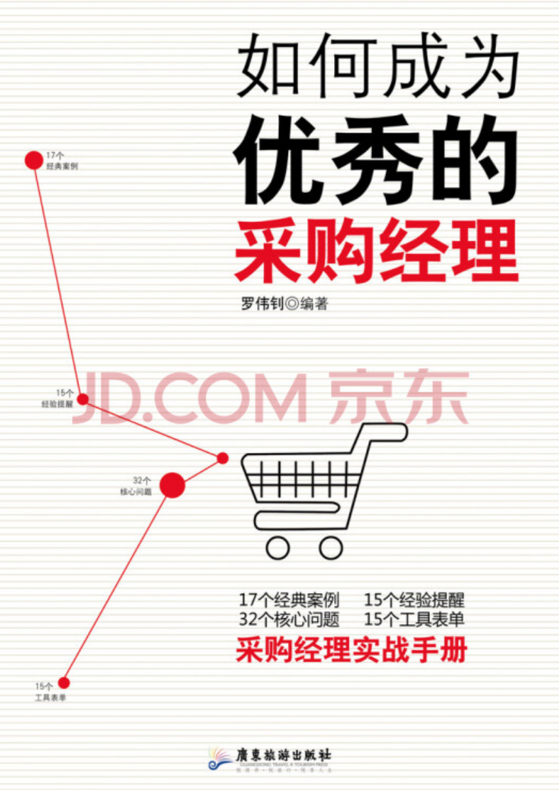

# 前言

最近一段时间，我的工作有了一些变动，未来我所接触的业务方向是**费用与资产系统**。从业务架构来看，**资产系统的上游是采购系统，下游是财务系统**。前不久，我已经学习了**《基础会计实务》**中有关财务的内容，那么今天我再来了解一下有关采购的内容。

今天我想和大家分享的书是：《如何成为优秀的采购经理》。严格来说，它并不是一本采购入门的书籍，由于最近我已自学了**《会计信息系统》**，从中大致了解了采购子系统的业务处理流程。因此我想通过此书，希望能更深入地了解一下采购业务本身。

而这本书的内容，更多地是介绍采购管理相关的方方面面，对于未来的业务边界来说，会是一个比较的触点。基于以上，我就趁这几天的空闲时间，好好挖掘了一番。有营养的内容都将摘录到下文中，大家看官有兴趣地可以细品一下~

# 采购管理 

**定义**: 为保障企业物资供应而对企业采购进货活动所进行的管理活动，是对整个企业采购活动的计划，组织，指挥，协调和控制活动。

**采购管理内容包括**：

- 制订采购计划
- 对采购活动的管理
- 对采购人员的管理
- 对采购资金的管理
- 对储运的管理
- 采购评价和监控
- 采购组织，机制，建设采购基础

**采购管理的目标**：

- 保障供应：保证不缺货，保证质量
- 节省费用：树立系统观念，追求总费用的节省，追求库存最小化
- 管理好供应链：建立一条有效率的供应链，供应链的有效操作，运行和控制
- 管理好信息

**采购管理的要件**：

- 采购计划管理
- 采购订单管理
- 发票校验

# 采购组织的制度

主要有以下几种:

- **集中制**：将采购工作集中于一个部门办理，达到极点时，总公司各部门，分部门及各工厂均无采购权
- **分散制**：将采购工作分散给各需用部门分别办理
- **混合制**：凡属共同性物料、采购金额较大者或进口品等，均集中由总公司采购部办理；小额、因地制宜，临时性的采购，则授权分公司或各工厂执行

# 采购方式

主要的采购方式有:

- 招标采购
- 竞争性谈判采购
- 询价采购
- 定点采购
- 集中采购
- 分散采购
- 现货采购
- 远期合同采购
- 直接采购
- 间接采购

# 什么是5R原则 

- 适价
- 适质
- 适量
- 适时
- 适地

5R原则就是: 从“合格的”供应商那里，在“需求的”时间内，以“合理的”价格，取得“正确的”数量和“符合品质要求的”物品与服务。

**采购前置期**： 从采购者下订单到所购的物品进公司验收，品检，入库完毕所需要的时间。

**订购点的计算方法**：采购前置期 * 生产的速度（每天所需要的量） + 安全库存

# 品质的构成要素

主要包括：

- 功能
- 寿命
- 稳定性
- 安全性
- 时尚性

# 供应商品质管理

主要方式包括：

- 派驻检验人员到供应商处
- 供应商品质体系审查
- 定期评比
- 供应商扶植
- 第三方权威机构作品质验证

# 验收的基本原则

基本原则共计5条，具体如下：

- 制定标准规格
- 招标书及合约条款应明确
- 设立健全的验收组织
- 采购与验收工作必须明白划分
- 讲求效率

**订货量**： 

订货量=订货周期和预备期间中的预计销售量+订货周期和预备期间中的安全库存-（现有的存货量+已订购的数量）+接受订货的差额

**订货点**：

订货点=平均销售速度（一个月内的平均销售量）*预备期间+安全存量

# 采购价格的种类

**1. 到厂价与出厂价**:

到厂价：供应商的报价

出厂价：供应商的报价不包括运送责任，即采购方雇用运输工具，前往供应商的制造厂提货

**2. 现金价与期票价**：

现金价：以现金或相等的方式支付货款（采购方可享受现金折扣）

期票价：采购方以期票或延期付款的方式来采购物品

**3. 净价与毛价**：

净价：采购方不再支付任何货款以外的交易费用

毛价：供应商的报价可以因某些因素加以折扣

**4. 现货价与合约价**：

现货价：每次交易时，由供需双方重新议定价格，若已签订买卖合约，也以完成交易后即告终止

合约价：买卖双方按照事先议定的价格进行交易，此合约价涵盖的期间依合约而定，短则几个月，长则一两年

**5. 定价与实价**：

定价：物品标示的价格

实价：采购方实际上所支付的代价

# 采购价格调查信息收集方式

主要有三类：

- 上游法
- 下游法
- 水平法

**上游法**：查询制造成本及产量资料

**下游法**：查询需求量及售价资料

**水平法**：查询替代品或新供应商的资料

# 采购成本的构成

主要有：

- 维护成本
- 订购成本
- 缺料成本

**1. 维护成本**：

定义：为保持物料而发生的成本；它可以分为固定成本和变动成本。

具体项目有：

- 资金成本
- 搬运成本
- 仓储成本
- 折旧及陈腐成本
- 其他

**2. 订购成本**：

定义：企业为了实现一次采购而进行的各种活动的费用。

具体项目有：

- 请购手续成本
- 采购成本
- 进货验收成本
- 进库成本
- 其他成本

**3. 缺料成本**：

定义：由于物料供应中断而造成的成本。

具体项目有：

- 安全存货及其成本
- 延期交货及其成本
- 失销成本
- 失去客户的成本

# 采购成本的控制方法

**1. 完善采购基础管理**

**2. 完善采购制度**

- 建立完善，严格的采购制度
- 建立供应商档案
- 要建立供应商准入制度
- 建立价格档案和价格评价体系
- 建立材料的标准采购价格，对采购人员根据工作业绩进行奖惩

**3. 完善采购流程**

- 企业年度及月度采购计划的制订
- 采购环节，实现购入材料最佳价
- 严格检验，入库手续
- 货款支付

**4. 优选采购技术方法**

- 依据经济性订购量计算模型采购
- 大力推行招标比价采购
- 实现联合，集中采购
- 实行买断采购
- 用国产材料替代进口材料
- 加强与供应商生产成本洽谈
- 积极开展电子商务采购

# 供应商管理原则 

主要是四个方面

- 门当户对原则 
- 半数比例原则（购买数量不能超过供应商产能的50%）
- 供应源数量控制原则（2-3家，分主次）
- 供应链战略原则

**几种货源策略**：

|类型|说明|示例国家|
|----|----|----|
|唯一货源策略|适用于专利产品，独家核心技术领域|日本|
|多货源策略|供应商竞争，优化供应商基准|美国|
|第二货源策略|规避单一货源的供应风险，也可合理分配比例|中国|

**供应商准入制度**：

核心是对供应商资格的要求。

# 供应商评价体系

- 供应商进入评价体系
- 供应商运行评价体系
- 供应商问题的辅导和改进
- 供应商战略伙伴关系评价

**供应商运行评价体系QSTP加权标准**：

- 供应质量Quality: 35%
- 供货服务Service: 25%
- 技术考核Technology: 10%
- 价格Price: 30%

# 供应商分类

- 战略供应商
- 优先供应商
- 考察供应商
- 消极淘汰供应商
- 积极淘汰供应商
- 身份未定供应商

# 运行合同管理供应商

- 供应商分类
- 合同起草（尽量使用本公司的合同文本）
- 合同谈判（单页战略总结；谈判总结；升级渠道）
- 合同执行

# 供应商会见制

- 接待时间要求
- 接待地点要求
- 洽谈内容要求

# 供应商激励机制

- 逐渐建立起一种稳定可靠的关系
- 有意识地引入竞争机制
- 与供应商建立相互信任的关系
- 建立相应的监督控制措施

# 供应商开发

**基本准则（Q.C.D.S原则）**：

- 质量
- 成本 
- 交付
- 服务

**流程**：

- 供应市场竞争分析
- 寻找潜在供应商
- 潜在供应商评估
- 询价和报价
- 合同条件谈判

# 供应商绩效评估五步骤

- 划分考核层次
- 建立评估准则
- 划分绩效等级并分析
- 重新分类并调整采购策略
- 反馈考核结果并督促其改善

# 防止供应商垄断

- 多找一家供应商
- 更好地掌握信息
- 注意经营总成本
- 让最终客户参与
- 协商长期合同
- 一次采购
- 与其他用户联系

# 采购作业监控的方法

主要包括4个方面：

- 建立、健全完善的采购管理制度
- 实施采购标准化作业
- 建立采购评价制度
- 及时对采购人员进行奖惩

# 后记

书本核心的摘要会让知识更聚焦，但由于一些细节与案例的缺失，想很好地理解要点知识，还是有必要好好读一下书的。至于消化书本的全部内容，更是要花费我们很长一段时间。希望未来这些知识真的能在业务沟通中使用到，并能为我提供必要的帮助。

本次内容有些枯燥，感谢各位阅读到这，也希望这些摘录的知识能帮助到你~ 

下次再见！
